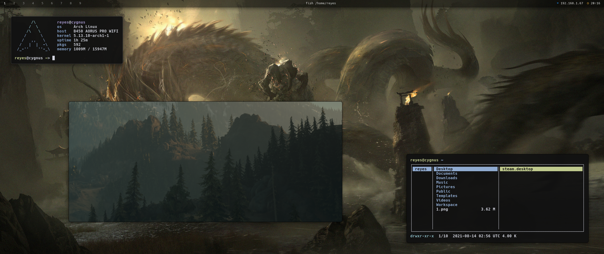

# Dotfiles

My personal dotfiles are Open-Source, feel free to use anything you want.

The dotfiles includes:

- Alacritty
- BSPWM
- Dmenu
- Dunst
- Fish
- Neofetch
- Nitrogen
- Picom
- Polybar
- Sxhkd

> sxhkd uses `spotifyctl` to manage music in spotify. See https://github.com/mihirlad55/polybar-spotify-module
